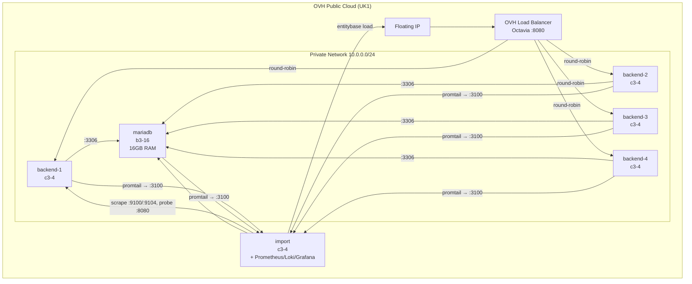

# entitybase-test

Automated infrastructure for benchmarking [EntityBase](https://github.com/Entitybasedev/entitybase-orchestrator) with Wikidata on OVH Public Cloud.

## Architecture



### Observability

Self-hosted infra monitoring, deployed with the rest of the stack (no alerting,
ephemeral state — destroyed with `just destroy`):

| Component | Location | Purpose |
|-----------|----------|---------|
| Prometheus | import | Metrics scrape + storage |
| Loki | import | Log aggregation (journal + import logs) |
| Grafana | import :3000 | Provisioned benchmark dashboard |
| node_exporter | all hosts | CPU / RAM / disk / network |
| mysqld_exporter | mariadb | MariaDB metrics (read-only `metrics` user) |
| Promtail | all hosts | Ships systemd journal to Loki |

All traffic stays on the private network except Grafana on port 3000. Grafana
admin password defaults to `entitybase`; override with `GRAFANA_ADMIN_PASSWORD`.

## Repository Structure

```
entitybase-test/
├── tofu/           # OpenTofu IaC for OVH infrastructure
├── ansible/        # Configuration and deployment playbooks
├── justfile        # End-to-end test orchestration (run `just --list`)
└── clouds.yaml     # OVH credentials (not committed)
```

## What It Does

The justfile automates:

1. Create OVH infrastructure via OpenTofu (4 backends + import + MariaDB + LB)
2. Wait for SSH connectivity
3. Install prerequisites on all instances
4. Install EntityBase on backends and import host
5. Configure MariaDB 11.4 (16GB tuned)
6. Download and load the Wikidata lexeme dump (import host only)
7. Run measurements and collect results
8. Optionally tear down the infrastructure (instances first, volumes later)

## Instance Roles

| Instance | Flavor | Role |
|----------|--------|------|
| backend-1..4 | c3-4 | EntityBase API server, behind LB |
| import | c3-4 | Downloads dump + runs `entitybase load` |
| mariadb | b3-16 | MariaDB 11.4 (16GB tuned) |

## Requirements

- [OpenTofu](https://opentofu.org/) >= 1.5
- [Ansible](https://www.ansible.com/)
- [just](https://github.com/casey/just) (command runner)
- [jq](https://stedolan.github.io/jq/)
- OVH Public Cloud account
- SSH key registered in OVH

## Setup

1. Place your `clouds.yaml` in `~/.config/openstack/` or the project root:

```yaml
clouds:
  openstack:
    auth:
      auth_url: https://auth.uk1.cloud.ovh.net/v3
      application_credential_id: "YOUR_ID"
      application_credential_secret: "YOUR_SECRET"
    region_name: UK1
```

2. Ensure your SSH public key exists at `tofu/id_ed25519.pub`

3. Edit `tofu/terraform.tfvars` for your configuration:

```hcl
region          = "UK1"
image           = "Ubuntu 24.04"
ssh_key_name    = "entitybase-test"
backend_count   = 4
backend_flavor  = "c3-4"
import_flavor   = "c3-4"
mariadb_flavor  = "b3-16"
```

## Usage

```bash
# Provision infrastructure
just provision

# Deploy EntityBase + load wikidata
just deploy

# Load wikidata lexemes only
just lexemes

# Load wikidata items only (~150GB, takes hours)
just items

# Check infrastructure status
just status

# Deploy observability stack alone (Grafana at http://<import_ip>:3000)
just observability

# SSH into instances
just ssh-import
just ssh-mariadb
just ssh-backend 1

# Tear down in two steps: instances first, inspect the data, then volumes
just teardown-instances
# (MariaDB is stopped gracefully first, so the data volume needs no recovery)
# ... inspect the retained volumes (OVH console / snapshots) ...
just teardown-volumes

# Or tear down everything in one go
just destroy
```

## License

GNU General Public License v3.0 or later. See [LICENSE](LICENSE) for details.
