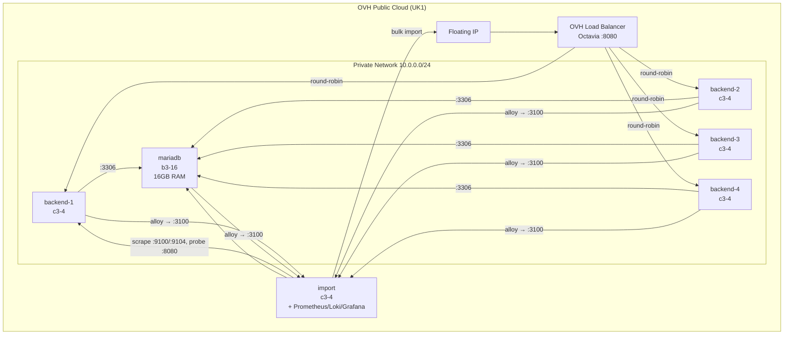

# entitybase-test

Automated infrastructure for benchmarking [EntityBase](https://github.com/Entitybasedev/entitybase-orchestrator) with Wikidata on OVH Public Cloud.

## Architecture



### How it works, in words

The stack is a classic three-tier benchmark rig, plus an operator's
workstation node, on one private OpenStack network.

**Traffic path.** All benchmark traffic enters through an **Octavia load
balancer** that owns the only public entry point (a floating IP, HTTP on
:8080). It round-robins requests to N identical **EntityBase backend** nodes,
each running the API server on :8000. The backends are stateless — every read
and write goes to a single shared **MariaDB 11.4** server on the private
network (:3306, reachable only from inside the 10.0.0.0/24 net). The benchmark
therefore measures how hard the database layer can be pushed while scaling the
API tier horizontally.

**The database node** is deliberately oversized (b3-16, 16 GB RAM) and its
data lives on a dedicated Cinder volume mounted at `/data/mysql`, with InnoDB
tuned for the available memory. Splitting the database onto its own instance
and volume means it can be stopped gracefully and its volume snapshotted,
inspected, or reused independently of the compute — which is exactly how the
two-step teardown (`teardown-instances` → `teardown-volumes`) works.

**The import node** does two jobs:

1. *Bulk data loading.* It downloads the Wikidata dumps onto its own large
   Cinder volume and streams them through the public load balancer into
   EntityBase, exercising the same API path clients would use. It also hosts
   a small Python progress dashboard on :80 so you can watch the import in
   real time.
2. *Observability.* It runs the self-hosted monitoring stack: Prometheus
   (scrapes `node_exporter` on every host and `mysqld_exporter` on the
   database), Loki (log aggregation), and Grafana on :3000 with a
   pre-provisioned benchmark dashboard. Every host ships its systemd journal
   to Loki via Grafana Alloy. Prometheus also blackbox-probes the API through
   the load balancer.

**Security posture.** Everything except SSH, the load balancer (:8080), the
dashboard (:80), Grafana (:3000) and Adminer (:8081) is locked to the private
network, and those public ports are additionally restricted to the admin CIDR
in the OpenStack security group. All service traffic (API→DB, metric scrapes,
log shipping) stays on 10.0.0.0/24 and never crosses the internet.

**Adminer**, a small web DB UI deployed on the import node (:8081, HTTP basic
auth), lets you browse the MariaDB data during and after imports. It connects
over the private network to the database, so no database port is ever exposed
publicly.

Run `just infra` at any time to print the live map of instances, IPs, ports
and credentials.

### Observability

Self-hosted infra monitoring, deployed with the rest of the stack (no alerting,
ephemeral state — destroyed with `just destroy`):

| Component | Location | Purpose |
|-----------|----------|---------|
| Prometheus | import | Metrics scrape + storage |
| Loki | import | Log aggregation (journal + import logs) |
| Grafana | import :3000 | Provisioned benchmark dashboard |
| node_exporter | all hosts | CPU / RAM / disk / network |
| mysqld_exporter | mariadb | MariaDB metrics (read-only `metrics` user) |
| Grafana Alloy | all hosts | Ships systemd journal + import logs to Loki |

All traffic stays on the private network except Grafana on port 3000. Grafana
admin password is read from `GRAFANA_ADMIN_PASSWORD` (required — `just provision`
and `just deploy` fail early if it is not set).

## Repository Structure

```
entitybase-test/
├── tofu/           # OpenTofu IaC for OVH infrastructure
├── ansible/        # Configuration and deployment playbooks
├── justfile        # End-to-end test orchestration (run `just --list`)
└── clouds.yaml     # OVH credentials (not committed)
```

## What It Does

The justfile automates:

1. Create OVH infrastructure via OpenTofu (4 backends + import + MariaDB + LB)
2. Wait for SSH connectivity
3. Install prerequisites on all instances
4. Install EntityBase on backends and import host
5. Configure MariaDB 11.4 (16GB tuned)
6. Download and load the Wikidata lexeme dump (import host only)
7. Run measurements and collect results
8. Optionally tear down the infrastructure (instances first, volumes later)

## Instance Roles

| Instance | Flavor | Role |
|----------|--------|------|
| backend-1..4 | c3-4 | EntityBase API server, behind LB |
| import | c3-4 | Downloads dump + bulk import; Prometheus / Loki / Grafana |
| mariadb | b3-16 | MariaDB 11.4 (16GB tuned) |

## Requirements

- [OpenTofu](https://opentofu.org/) >= 1.5
- [Ansible](https://www.ansible.com/)
- [just](https://github.com/casey/just) (command runner)
- [jq](https://stedolan.github.io/jq/)
- OVH Public Cloud account
- SSH key registered in OVH

## Setup

1. Provide an OpenStack `clouds.yaml`. Any OpenStack-compatible provider works;
   for OVH Public Cloud, the easiest route is via Horizon
   (`horizon.cloud.ovh.net`, region-dependent):

   - Log in and go to **Project → API Access**
   - Click the **"Download OpenStack RC File"** dropdown and choose
     **"OpenStack clouds.yaml File"**
   - Alternatively, create an Application Credential
     (**Identity → Application Credentials → Create Application Credential**)
     and click **Download clouds.yaml** — this is the recommended option since
     the credential can be revoked independently of your user password

   Place the file in `~/.config/openstack/` (or the project root) with secure
   permissions, e.g.:

   ```bash
   mkdir -p ~/.config/openstack
   mv ~/Downloads/clouds.yaml ~/.config/openstack/clouds.yaml
   chmod 600 ~/.config/openstack/clouds.yaml
   ```

   The tofu provider uses the cloud named `openstack`. If you downloaded
   an application-credential file, ensure the cloud entry is named
   `openstack` and uses `application_credential_id` /
   `application_credential_secret`:

   ```yaml
   clouds:
     openstack:
       auth:
         auth_url: https://auth.uk1.cloud.ovh.net/v3
         application_credential_id: "YOUR_ID"
         application_credential_secret: "YOUR_SECRET"
       region_name: UK1
   ```

2. Ensure your SSH public key exists at `tofu/id_ed25519.pub`

3. Edit `tofu/terraform.tfvars` for your configuration:

```hcl
region          = "UK1"
image           = "Ubuntu 24.04"
ssh_key_name    = "entitybase-test"
backend_count   = 4
backend_flavor  = "c3-4"
import_flavor   = "c3-4"
mariadb_flavor  = "b3-16"
```

## Usage

```bash
# Provision infrastructure
just provision

# Deploy EntityBase + load wikidata
just deploy

# Load wikidata lexemes only
just lexemes

# Load wikidata items only (~150GB, takes hours)
just items

# Check infrastructure status
just status

# SSH into instances
just ssh-import
just ssh-mariadb
just ssh-backend 1

# Tear down in two steps: instances first, inspect the data, then volumes
just teardown-instances
# (MariaDB is stopped gracefully first, so the data volume needs no recovery)
# ... inspect the retained volumes (OVH console / snapshots) ...
just teardown-volumes

# Or tear down everything in one go
just destroy
```

## License

GNU General Public License v3.0 or later. See [LICENSE](LICENSE) for details.
