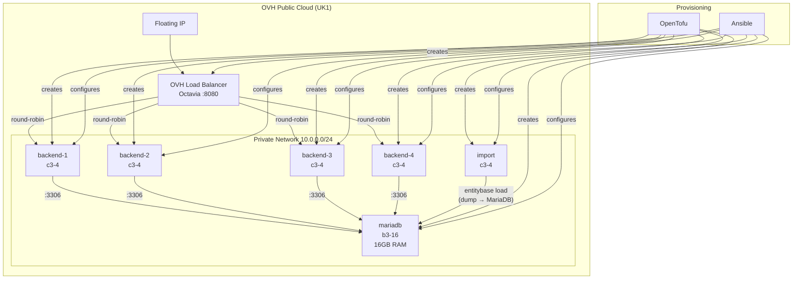

# entitybase-test

Automated infrastructure for benchmarking [EntityBase](https://github.com/Entitybasedev/entitybase-orchestrator) with Wikidata on OVH Public Cloud.

## Architecture



## Repository Structure

```
entitybase-test/
├── tofu/           # OpenTofu IaC for OVH infrastructure
├── ansible/        # Configuration and deployment playbooks
├── run-test.sh     # End-to-end test orchestration
└── clouds.yaml     # OVH credentials (not committed)
```

## What It Does

`run-test.sh` automates:

1. Create OVH infrastructure via OpenTofu (4 backends + import + MariaDB + LB)
2. Wait for SSH connectivity
3. Install prerequisites on all instances
4. Install EntityBase on backends and import host
5. Configure MariaDB 11.4 (16GB tuned)
6. Download and load the Wikidata lexeme dump (import host only)
7. Run measurements and collect results
8. Optionally destroy the infrastructure

## Instance Roles

| Instance | Flavor | Role |
|----------|--------|------|
| backend-1..4 | c3-4 | EntityBase API server, behind LB |
| import | c3-4 | Downloads dump + runs `entitybase load` |
| mariadb | b3-16 | MariaDB 11.4 (16GB tuned) |

## Requirements

- [OpenTofu](https://opentofu.org/) >= 1.5
- [Ansible](https://www.ansible.com/)
- [jq](https://stedolan.github.io/jq/)
- OVH Public Cloud account
- SSH key registered in OVH

## Setup

1. Place your `clouds.yaml` in `~/.config/openstack/` or the project root:

```yaml
clouds:
  openstack:
    auth:
      auth_url: https://auth.uk1.cloud.ovh.net/v3
      application_credential_id: "YOUR_ID"
      application_credential_secret: "YOUR_SECRET"
    region_name: UK1
```

2. Ensure your SSH public key exists at `tofu/id_rsa.pub`

3. Edit `tofu/terraform.tfvars` for your configuration:

```hcl
region          = "UK1"
image           = "Ubuntu 24.04"
ssh_key_name    = "entitybase-test"
backend_count   = 4
backend_flavor  = "c3-4"
import_flavor   = "c3-4"
mariadb_flavor  = "b3-16"
```

## Usage

```bash
# Full run: provision + deploy + benchmark
./run-test.sh up

# Deploy only (infrastructure already exists)
./run-test.sh deploy

# Check infrastructure status
./run-test.sh status

# Tear down everything
./run-test.sh destroy
```

## License

GNU General Public License v3.0 or later. See [LICENSE](LICENSE) for details.
